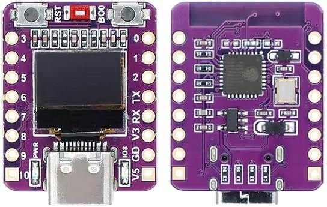
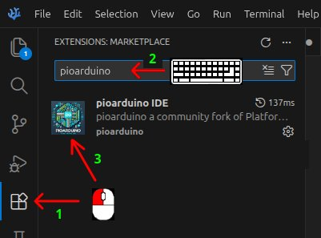

# mini_esp32c3_oled_sketches
Simultaneous use of SPI and I2C with Mini ESP32C3 with 0.42" OLED display board

***April 21, 2026***


This repository contains a few PlatformIO/pioarduino projects for a common mini ESP32-C3-based development board that sports an onboard 0.42" OLED display and a USB-C connector. 



The image above, *borrowed* from a vendor site, corresponds exactly to the board used to create the projects, including the absence of any markings that could identify the original manufacturer or vendor.

---
**Table of Content**

<!-- TOC -->

- [1. Hardwired I2C Pin Assignement](#1-hardwired-i2c-pin-assignement)
- [2. Proposed pins_arduino.h](#2-proposed-pins_arduinoh)
  - [2.1. Variant mini_esp32c3_oled](#21-variant-mini_esp32c3_oled)
  - [2.2. Variant esp32c3_oled_mini](#22-variant-esp32c3_oled_mini)
  - [2.3. Better Choice](#23-better-choice)
- [3. pioarduino](#3-pioarduino)
- [4. Projects](#4-projects)
  - [4.1. Project: `01_pin_names`](#41-project-01_pin_names)
  - [4.2. Project: `24_spi_master`](#42-project-24_spi_master)
  - [4.3. Project: `25_spi_slave`](#43-project-25_spi_slave)
  - [4.4. Project: `27_i2c_oled`](#44-project-27_i2c_oled)
  - [4.5. Project: `28_spi_master_i2c_oled`](#45-project-28_spi_master_i2c_oled)
  - [4.6. Project: `29_spi_slave_i2c_oled`](#46-project-29_spi_slave_i2c_oled)
- [5. References](#5-references)
- [6. License](#6-license)

<!-- /TOC -->
---

## 1. Hardwired I2C Pin Assignement

The common pin assignment of the generic ESP32C3 Super Mini boards is

```c
static const uint8_t TX = 21;
static const uint8_t RX = 20;

static const uint8_t SDA = 8;
static const uint8_t SCL = 9;

static const uint8_t SS = 7;
static const uint8_t MOSI = 6;
static const uint8_t MISO = 5;
static const uint8_t SCK = 4;

static const uint8_t A0 = 0;
static const uint8_t A1 = 1;
static const uint8_t A2 = 2;
static const uint8_t A3 = 3;
static const uint8_t A4 = 4;    
```

Vendors of the mini board with the OLED display generally display a pinout diagram that corresponds to the above assignment, but then add an additional information which corresponds to the physical connection of the OLED display to the SoC.

```
OLED SDA = 5
OLED SCL = 6
```

The I/O pins 8 and 9 can indeed be attached to the I2C controller, but since there is only one I2C controller, the OLED display cannot be used with that pin assignment. Consequently, example projects for the board with an onboard display use a generic ESP32C3 Super Mini board definition and override the I2C pin assignment in the source code. That creates a problem because I/O pins 5 and 6 cannot be attached to the I2C and SPI controllers simultaneously. To use a SPI connection along with an I2C device, it would be necessary to override the variant pin definition with an explicit redefinition in the source code when initializing the SPI device as done with I2C. 

## 2. Proposed pins_arduino.h 

The preferable approach is to define a proper pin assignment in a new variant `pins_arduino.h` file. Two versions are proposed here that differ only with regard to the pin to be attached to the SS signal of the SPI interface.

The objective of these definitions is to make it easy to use the SPI and I2C interfaces of the mini ESP32C3 board with onboard I2C display with a minimum impact on the other capabilities of the SoC.


### 2.1. Variant mini_esp32c3_oled

```c
static const uint8_t TX = 21;
static const uint8_t RX = 20;

static const uint8_t SDA = 5;  // connected to onboard OLED
static const uint8_t SCL = 6;  // connected to onboard OLED

static const uint8_t SS = 8;
static const uint8_t MOSI = 10;
static const uint8_t MISO = 9;
static const uint8_t SCK = 7;

static const uint8_t A0 = 0;
static const uint8_t A1 = 1;
static const uint8_t A2 = 2;
static const uint8_t A3 = 3;
static const uint8_t A4 = 4;
```

- Pinout Diagram: [link](images/mini_esp32c3_oled.png)
- Advantage: All valid analogue input pins are free.
- Disadvantage: I/O pin 8 is a strapping pin and it controls the user LED.

### 2.2. Variant esp32c3_oled_mini

```c
static const uint8_t TX = 21;
static const uint8_t RX = 20;

static const uint8_t SDA = 5;  // connected to onboard OLED
static const uint8_t SCL = 6;  // connected to onboard OLED

static const uint8_t SS = 0;
static const uint8_t MOSI = 10;
static const uint8_t MISO = 9;
static const uint8_t SCK = 7;

static const uint8_t A0 = 0;
static const uint8_t A1 = 1;
static const uint8_t A2 = 2;
static const uint8_t A3 = 3;
static const uint8_t A4 = 4;
```

- Pinout Diagram:  [link](images/esp32c3_oled_mini.png)
- Advantage: The user LED remains available.
- Disadvantage: One of the five analogue input pin is no longer available.

Of course, any I/O pin from 1 to 4 (A1 to A4) could be connected to the SS signal of the SPI controller with the same result as obtained by choosing 0 (A0).

### 2.3. Better Choice

In most cases either board definition should work. The exception would be trying to use GPIO 8 as an active high SS signal for some bizarre technical reason. This would probably not work since GPIO 8, as a strapping pin, is pulled to 3.3 volts. Until the IO pin is set low in the startup code, the SPI slave would be trying to read spurious data on MOSI with an invalid clock signal. 

That said, the `esp32c3_oled_mini` definition is probably the better choice if there is no need for five analogue inputs. To belabour the point, with that definition, the user LED will not be turned on  whenever a SPI transfer occurs. Indeed, IO pin 8 remains available to control the user LED.

## 3. pioarduino

The sketches in this repository are meant to be compiled in the [pioarduino](https://github.com/pioarduino/pioarduino-vscode-ide) fork of [PlatformIO](https://platformio.org/). The former is arguably better than the latter when using recent ESP32 microcontrollers. 

There are no Arduino versions of the sketches because a simple way of adding third party board definitions in that environment without distributing a modified version of the huge (2.5+ MBytes) `boards.txt` file was not found.

Unlike the Arduino IDE, the pioarduino IDE is not a stand-alone application. It is an [extension](https://marketplace.visualstudio.com/items?itemName=pioarduino.pioarduino-ide) that can be installed in [Visual Studio Code](https://code.visualstudio.com/) (VSCode for short) editor. The extension is also available in the  [marketplace](https://open-vsx.org/extension/pioarduino/pioarduino-ide). [VSCodium](https://vscodium.com/) is a less well-known fork of VSCode that claims to have removed telemetry/tracking. Version 1.3.18 which was used while developing these sketches, does not contain the AI additions that have apparently been added to VSCode. 

The pioarduino IDE extension is available in the extension marketplace of both code editors. Consequently, its installation is a simple three-step procedure shown in the IKEA-like instruction diagram below.



All of the sketches in the repository have been successfully compiled with the [pioarduino-espressif32](https://github.com/pioarduino/platform-espressif32) platform version 55.03.37 released February 11, 2026. This contains the version 3.3.7 of the Arduino ESP32 core based on ESP-IDF v5.5.2.260206. All projects should compile without problems with the newest version of the platform, which is currently 55.03.33 based on v3.3.8 of the ESP32 Arduino core, but this has not been tested.

## 4. Projects

All sketches in the [super_mini_esp32c3_sketches](https://github.com/sigmdel/supermini_esp32c3_sketches) repository can be uploaded to the ESP32-C3 Mini with a 0.42" OLED display because the latter is essentially an ESP32-C3 Super Mini with the extra constraint that the OLED display's SDA and SCL signal lines are connected to GPIO 5 and 6. Consequently, this repository only contains projects that are applicable to the ESP32-C3 OLED Mini where using a bespoke board definition is helpful.

The first project `01_pin_names` is similar to the sketch of the same name in [super_mini_esp32c3_sketches](https://github.com/sigmdel/supermini_esp32c3_sketches) but it is modified to show the pin assignment defined in the proposed board definitions for the Mini with OLED display. Similarly, `27_i2c_oled`, is a reprise of the same project in the 
in [super_mini_esp32c3_sketches](https://github.com/sigmdel/supermini_esp32c3_sketches) modified to use either board definition proposed herein.  

More interestingly,  `28_spi_master_i2c_oled` and `29_spi_slave_i2c_oled` are new projects that show how either of the board definitions proposed here facilitates the use of the Mini with OLED when using the I2C and SPI (as master or slave) controllers simultaneously. The `24_spi_master` and `25_spid_slave` projects are here only to help in testing the SPI and I2C peripherals of the Mini with OLED when a second board of that type is not available.

### 4.1. Project: `01_pin_names`

**Purpose:** Display the I/O pin numbers and names and various macro definitions of ESP32-C3 mini board with onboard 0.42" OLED display
 or the generic ESP32-C3 super mini board  
 
**Notes:** 

- Can be compiled for the generic ESP32-C3 Super Mini board using the `nologo_esp32c3_super_mini` environment or for the ESP32C3 Mini with OLED display using either the `esp32c3_oled_mini` or `mini_esp32c3_oled` environment in the `platformio.ini` configuration file. 

- Before compiling the program choose the correct environment in the project's `platformio.ini` configuration file.

  ```ini
  [platformio]
  default_envs = esp32c3_oled_mini   ; SS = 0
  ;default_envs = mini_esp32c3_oled   ; SS = 8
  ;default_envs = nologo_esp32c3_super_mini      
  ```
  This version will yield slightly different results when run on a generic ESP32-C3 Super Mini board than the version from the [super_mini_esp32c3_sketches](https://github.com/sigmdel/supermini_esp32c3_sketches) because it will signal the absence of the `ARDUINO_ESP32C3_OLED_MINI` and `ARDUINO_MINI_ESP32C3_OLED` macros which are defined in the ESP32-C3 Mini board with OLED display board definitions.


### 4.2. Project: `24_spi_master`

***Purpose:*** Test of SPI communication as a SPI master device.

***Notes:***

- This is the SPI master device which must be connected to a slave SPI device which could be another ESP32-C3 Mini running the `29_spi_slave_i2c_oled` sketch or a generic ESP32-C3 running the `25_spi_slave` sketch.

- Use this sketch to test the ESP32C3 Mini with OLED display as a SPI slave device when a second Mini with OLED display is not available.

- This is essentially the same example found in the `24_spi_master` example in [super_mini_esp32c3_sketches](https://github.com/sigmdel/supermini_esp32c3_sketches/tree/main/24_spi_master). 


### 4.3. Project: `25_spi_slave`

***Purpose:*** Test of SPI communication as a SPI slave device.

***Notes:***

- This is the SPI slaver device which must be connected to a slave SPI device which could be another ESP32-C3 Mini running the `28_spi_master_i2c_oled` sketch or a generic ESP32-C3 Super Mini running the `24_spi_master` sketch.

- Use this sketch to test the ESP32C3 Mini with OLED display as a SPI master device when a second Mini with OLED display is not available.

- This is essentially the same example found in the `25_spi_slave` example in [super_mini_esp32c3_sketches](https://github.com/sigmdel/supermini_esp32c3_sketches/tree/main/25_spi_slave). 


### 4.4. Project: `27_i2c_oled`

***Purpose:** Test the I2C peripheral of an ESP32-C3 Mini with a 0.42" OLED I2C display.

***Notes:*** 

- Requires an ESP32C3 Mini with OLED display. Use either the `esp32c3_oled_mini` or `mini_esp32c3_oled` environment in the `platformio.ini` configuration file. 

- This is essentially the same example found in the [27_i2c_oled example in super_mini_esp32c3_sketches](https://github.com/sigmdel/supermini_esp32c3_sketches/tree/main/27_i2c_oled) except that the I2C SDA and SCL pins are correctly identified in the board definition.


### 4.5. Project: `28_spi_master_i2c_oled`

***Purpose:*** Simultaneously test the SPI and I2C peripherals of an ESP32-C3 Mini with a 0.42" OLED I2C display.

***Notes:***

 - This is the SPI master device which must be connected to a slave SPI device which could be another ESP32-C3 Mini running the `29_spi_slave_i2c_oled` sketch or a generic ESP32-C3 running the `25_spi_slave` sketch.

 - Requires an ESP32C3 Mini with OLED display. Use either the `esp32c3_oled_mini` or `mini_esp32c3_oled` environment in the `platformio.ini` configuration file. 


### 4.6. Project: `29_spi_slave_i2c_oled`

***Purpose:*** Simultaneously test the SPI and I2C peripherals of an ESP32-C3 Mini with a 0.42" OLED I2C display.

***Notes:***

 - This is the SPI slave device which must be connected to a master SPI device which could be another ESP32-C3 Mini running the `28_spi_master_oled` sketch or a generic ESP32-C3 running the `24_spi_master` sketch.

 - Requires an ESP32C3 Mini with OLED display. Use either the `esp32c3_oled_mini` or `mini_esp32c3_oled` environment in the `platformio.ini` configuration file. 


## 5. References

- [ESP32-C3 0.42 OLED](https://emalliab.wordpress.com/2025/02/12/esp32-c3-0-42-oled/) by Kevin (Kevin's Blog), 2025-02-12
    - They appear to be “ABRobot ESP32-C3 0.42 OLED” devices, at least when first powered on they display the text “ABrobot"
    - ArduinoIDE: board = ESP32C3 Dev Module
    - olikraus/u8g2, <U8g2lib.h> 
    - SDA and SCL hardwired as 5 and 6 in display u8g2() constructor
    
- [ESP32-C3-ABrobot-OLED](https://github.com/zhuhai-esp/ESP32-C3-ABrobot-OLED) by ZhuHai ESP (zhuhai-esp), last update 2024-07-31
    - PlatformIO: board = airm2m_core_esp32c
    - olikraus/u8g2, <U8g2lib.h> 
    - SDA and SCL hardwired as 5 and 6 in display u8g2() constructor

- [ESP32-C3 OLED](https://sharedinventions.com/?p=1098) by kelemenb 2025-03-26 on Shared Inventions
    - PlatformIO: board = esp32-c3-devkitm-1 
    - olikraus/u8g2, <U8g2lib.h> 
    - SDA_PIN=5, SCL_PIN=6 in Wire.begin()

- [SP32-C3 Tiny OLED Tutorial: Pinout, Setup & First Programs](https://projecthub.arduino.cc/Dziubym/sp32-c3-tiny-oled-tutorial-pinout-setup-first-programs-84634a)
  by Dziubym 2025-11-11
    - Arduino IDE: board = ESP32C3 Dev Module (as per [accompanying video](https://www.youtube.com/watch?v=B-t_nMiXfZM))
    - olikraus/u8g2, <U8g2lib.h> 
    - SDA_PIN=5, SCL_PIN=6 in Wire.begin()

- [ESP32-C3_OLED](https://github.com/peff74/ESP32-C3_OLED) by Stefan (peff74) last update 2025-08-17
    - Arduino IDE: board = ? 
    - olikraus/u8g2, <U8g2lib.h> 
    - OLED_SDA=5, OLED_SCL=6 in display u8g2() constructor

- [ESP32-C3 OLED Test](https://github.com/bilalakhtar/ESP32C3-abrobot-OLED/tree/main) by Bilal Akhtar (bilalakhtar) last update 2025-06-18
    - Arduino IDE: board = ? 
    - olikraus/u8g2, <U8g2lib.h> 
    - SDA and SCL hardwired as 5 and 6 in display u8g2() constructor

---

- [ESP32-C3-0.42 OLED](https://github.com/01Space/ESP32-C3-0.42LCD) last update 2022-07-21
   - 01Space variant with I2C OLED and I2C Qwiic connector
   - Arduino IDE: board = ESP32C3 Dev Module (`ESP32-C3-GraphisTest.ino` sketch),  
   - SDA_PIN=5, SCL_PIN=6 in Wire.begin()
   - MOSI=7, MISO=8, SCK=10 (no SS assignment) shown on pinout diagram which contradicts the chosen board. 

---

<!--

- [ESP32-C3 0.42" OLED (SSD1306)](https://github.com/ESP32Home/oled_042)
    - PlatformIO: board = esp32-c3-devkitm-1 
    - olikraus/u8g2


- [Arduino hands-on (216)-ESP32-C3 OLED development board ceramic antenna ESP32 development board wifi Bluetooth 0.42 inch screen](https://makelog.dfrobot.com.cn/article-318183.html)
  by Donkey Friends, 2025-09-15. Mishmash of 01Space info 

    
- [How to use onboard 0.42 inch OLED for ESP32-C3 OLED development board with micropython](https://electronics.stackexchange.com/questions/725871/how-to-use-onboard-0-42-inch-oled-for-esp32-c3-oled-development-board-with-micro)
    - stackexchange Electrical Engineering Forum, question by Jeff Hernandez 2024-06-21
    - mostly Python oriented  

- [Abrobot ESP32 C3 OLED Shield](https://docs.zephyrproject.org/latest/boards/shields/abrobot_esp32c3_oled/doc/index.html) Zephy 4.4.99 supported boards and shields.
    - board: esp32c3_042_oled
    - [Abrobot ESP32 C3 OLED Shield](https://docs.nordicsemi.com/bundle/ncs-3.1.0/page/zephyr/boards/shields/abrobot_esp32c3_oled/doc/index.html) in nRF Connect SDK (3.1.0)
    last updated 2025-08-13 is exactly the same

- [ABrobot ESP32-C3 Mini 72x40 OLED](https://github.com/shariltumin/esp32c3_mini_oled_micropython) 2025-05-11 
    - Micropython
    - SDA=5, SCL=6, 

- [ESP32-C3 mini with 0.42-OLED](https://github.com/karamo/ESP32-C3-mini-with-0.42-OLED) by Karamo Wolfgang Zelinka
    - docs only
    - common pinout with SCL=9 and SDA=8 and Display SCL=6 and SDA=5
-->

## 6. License

Copyright 2026, Michel Deslierres. No rights reserved

All code in this repository that is not under a specific license is in the public domain.
In those jurisdictions where this may be a problem, the BSD Zero Clause License applies.
 
SPDX-License-Identifier: [0BSD](https://spdx.org/licenses/0BSD.html)
